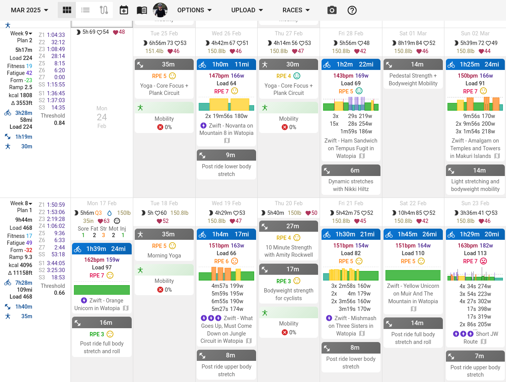
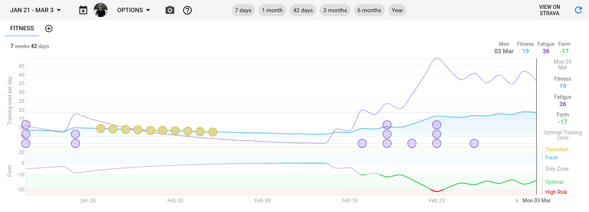

# NOW {.green}

##### Updated: 2025-03-02 @ 23:37

----

### 🎮 Playing {.green}
- [Dragon Quest III HD-2D Remake](https://dragonquest.square-enix-games.com/games/en-us/dragon-quest-123-hd2d-remakes/)
- [Balatro](https://www.playbalatro.com/)
- [TETR.IO](https://tetr.io/)

### 🎧 Listening To {.green}
- [3TEETH - 3TEETH](https://listenbrainz.org/album/3fae022b-1a18-47bb-83a7-58bf047b783c/)
- [Front Line Assembly](https://musicbrainz.org/release/a8849731-1daa-416a-80d4-8b12e08713e2)
- [Carpenter Brut - Leather Terror](https://listenbrainz.org/album/e2364ac4-56de-40b5-9eaf-8b4222636d4b/)
- [Processor - Purple](https://musicbrainz.org/release/0ac729fe-363e-48be-bad0-eed6a0b15f92)
- [Processor - Majesty](https://musicbrainz.org/release/adaebb33-92a1-4f8b-83ed-56453f364cb2)
- [Author & Punisher - Krüller](https://musicbrainz.org/release/4f732151-affe-404c-81fa-92923c319511)

### 📖 Reading {.green}
- _[Memory's Legion](https://search.worldcat.org/title/1300408288)_
 by James S.A. Corey
- _[The Cyclist's Training Bible]
(https://search.worldcat.org/title/1021056346)_ by Joe Friel
- _[Validation](https://search.worldcat.org/title/1428141080)_
 by Caroline Fleck
- _[Pocket Music Theory](https://search.worldcat.org/title/51577325)_
 by Hal Leonard

### 📓 Learning {.green}
- pytorch
- 日本語
- Lingua Italiana
- Deutsche Sprache
- How to make audio plugins (VST/CLAP/JSFX)

### ⚒️  Working On {.green}
- Electronic/Industrial music ideas
- pytorch
- Fitness

### 🗓️ Planning {.green}
- Cycling trip to Tuscany (with [inGamba](https://ingamba.pro/))
- Large group trip to Japan in 2026

\
I'm still still working on music, but at a MUCH slower pace than in 
2024. I plan to release some music this year, but its not clear when or 
what I will release. Maybe there will be a remix/remaster of some tracks
I created last year; maybe a "best of" album with my favorites. I've 
been working on some sort of Industrial/Synthwave tracks, but haven't 
gotten them to a state I'm happy with yet. They're a bit repetitive and
need to be built into more full tracks. I also plan to experiment a bit
with lyrics. I've always struggled with creating good lyrics; though, I
tried last year for tracks like
[MIZERA](https://weeklybeats.com/mukti/music/mizera-4),
[SORCO](https://weeklybeats.com/mukti/music/sorco),
[FINO](https://weeklybeats.com/mukti/music/fino), and
[DEVIO](https://weeklybeats.com/mukti/music/devio-2). Making lyrics that
don't feel cheesy, and get the idea/theme across is difficult when you
don't write often - its something I need to work on. I still want to
write up about WeeklyBeats, but I still need some more time to
reflect on it. Maybe after I make that "best of" album.

I mentioned this previously on my Now page, but I'm planning a cycling
tour in Tuscany, and actually booked the trip a couple weeks ago. I
booked with [inGamba](https://ingamba.pro/), which is a bit expensive,
but also seems like a pretty cool experience. The only thing you have to
think about is cycling, everything else is taken care of - travel from
the airport, meals, bike wash, laundry, daily massage... it's gonna be
amazing. Since that trip is only going to take a week, I'm debating if I
want to continue the trip for a week in Rome, or if I want to fly to
Munich to meet my brother for
[Oktoberfest](https://www.oktoberfest.de/en). I haven't fully decided on
the timing, and I'm not sure if my brother will be up to it, but it
could be fun! I'm also still planning a third trip to Japan for Spring
2026, but that's far enough away, that I think I still have plenty of
time to plan.

Since I'm planning a week long cycling tour, I decided to focus heavily
on training, and I've started aggressively working on my fitness. Since
the weather hasn't been great, I've just been using
[Zwift](https://www.zwift.com/) and a combination of
[Recover](https://recoverathletics.com/) and various Yoga videos to
improve my mobility. Historically I haven't been great at looking at my
actual fitness, or worried about over/under training. This year, I
started using [intervals.icu](https://intervals.icu/) to be a bit more
focused and intentional with my training:

{ width=75% }
{ width=75% }

I plan to work on a specific training plan for inGAMBA once the date
gets closer. To help with this and improve my understanding of my
training, I've also started listening to _The Cyclist's Training Bible_.
I'm hoping to improve my overall understanding of cycling fitness using
this, and improve my endurance and overall power output.

The first two months of the year have been interesting so far - hoping
for good things as the year progresses!

<svg height="1" width="100" style="display:block;margin:auto;"><line x1="0" y1="0" x2="100" y2="0" stroke="white" /></svg>

_For more information on "now" pages, check out: <https://nownownow.com/about>_
