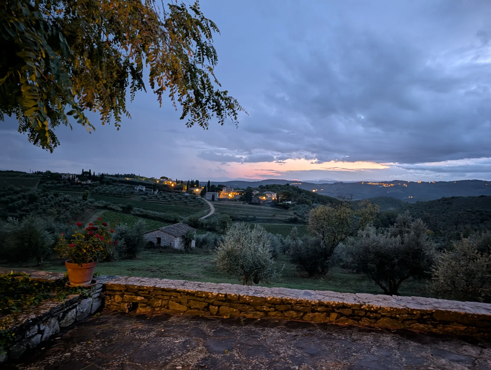
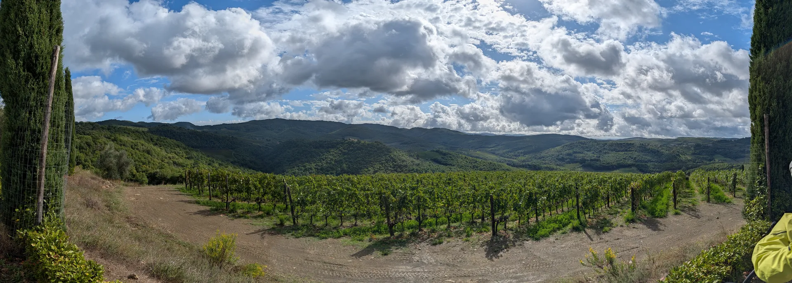
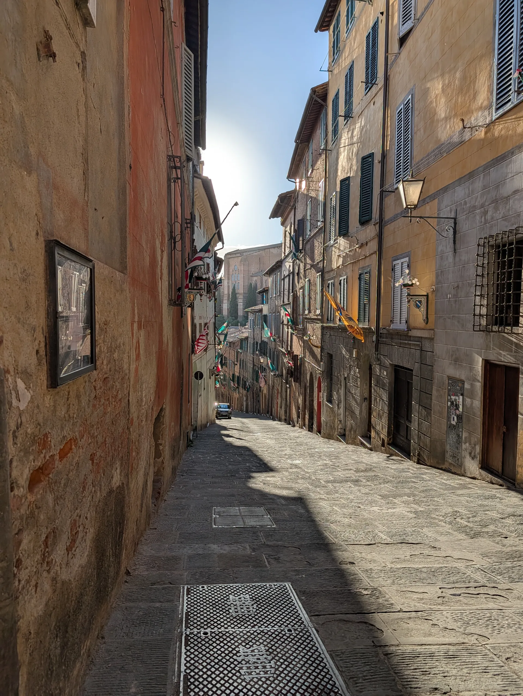
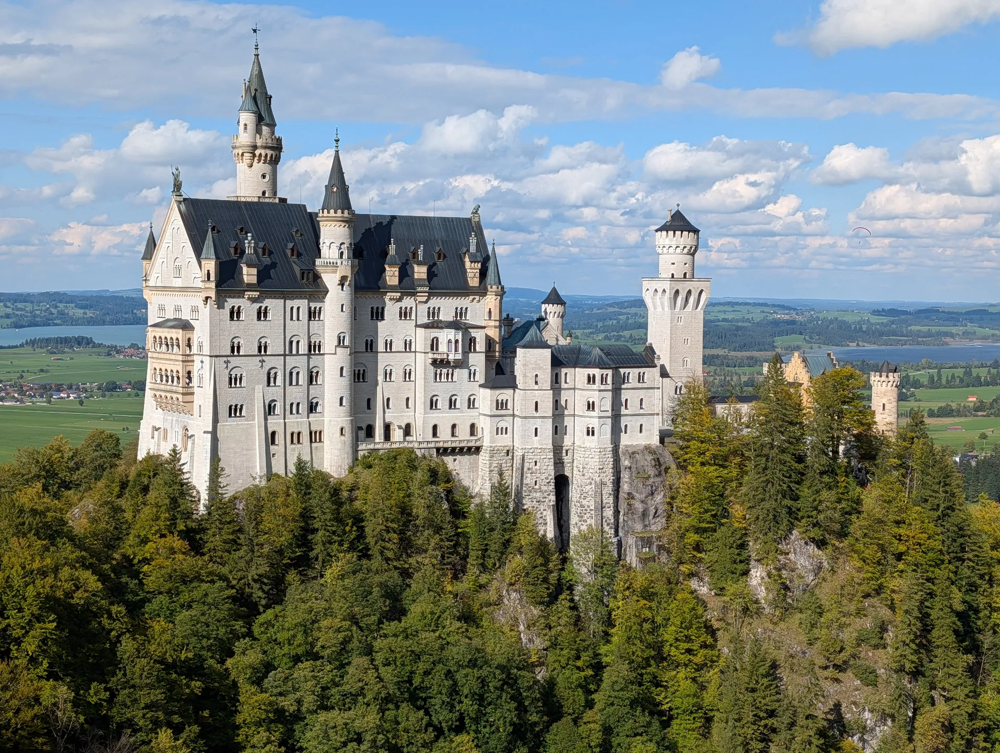
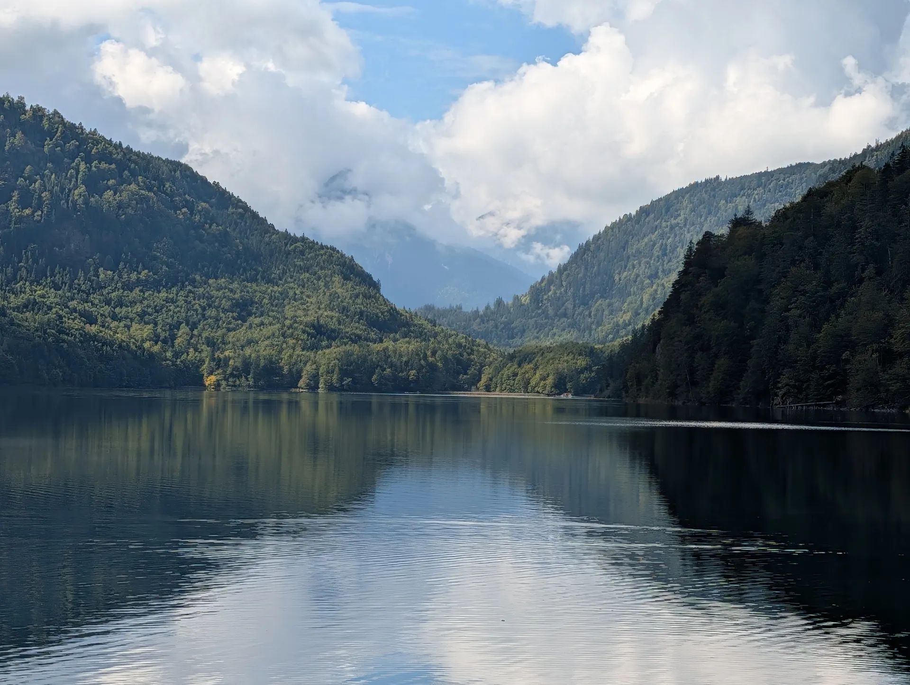

# NOW {.green}

##### Updated: 2025-10-12 @ 23:10

----

### 🎮 Playing {.green}
- [FINAL FANTASY TACTICS - The Ivalice Chronicles](https://final-fantasy-tactics-the-ivalice-chronicles.square-enix-games.com/en-us)
- [Dragon Quest III HD-2D Remake](https://dragonquest.square-enix-games.com/games/en-us/dragon-quest-123-hd2d-remakes/)

### 🎧 Listening To {.green}
- [Anamanaguchi - Anyway](https://musicbrainz.org/release-group/60696212-ec12-471a-b0ac-623c5827bbca)
- [Author & Punisher - Nocturnal Birding](https://musicbrainz.org/release-group/7b7ff2a0-bddc-4def-bc3c-8fc3d38bed1d)
- [Perturbator - Age of Aquarius](https://musicbrainz.org/release-group/d1f15703-adc2-4918-84db-47f5a9c6f034)
- [HEALTH - Conflict DLC](https://musicbrainz.org/release-group/19cdea2d-9fa3-4e7d-8aac-b255330a26b3)
- [Blush Response - Ego Death](https://musicbrainz.org/release-group/2b6c1c37-0265-4261-afda-10c8d219786e)

### 📖 Reading {.green}
- _[Memory's Legion](https://search.worldcat.org/title/1300408288)_
 by James S.A. Corey
- _[Enshittification](https://search.worldcat.org/title/1530163694)_
 by Cory Doctorow
- _[How to Destroy Surveillance Capitalism](https://search.worldcat.org/title/1245593437)_
 by Cory Doctorow

### 📓 Learning {.green}
- 日本語
- How to make audio plugins (VST/CLAP/JSFX)

### ⚒️  Working On {.green}
- Electronic/Industrial music ideas
- Fitness

### 🗓️ Planning {.green}
- Large group trip to Japan in 2026

\
It's been a while since I updated my now page, over six months! I didn't
train as much as I expected, but I still managed to complete the inGamba
tour in Tuscany. It was an amazing trip, and I'd definitely recommend
one of their tours to anyone who is looking for a guided cycling trip.
There were so many amazing routes, long climbs, historical sites, and
tons of great food. Each ride had a coffee/pastry/food stop about half
way through, often with local pastries (often with fresh grapes). I did
the Chianti Classico trip, which was centered around Lecchi in Chianti.
The area was very rural, but we cycled through lots of other nearby
small towns. 

{ width=100% } 
{ width=100% }

The trip was all-inclusive, so every morning you'd have fresh food
ready for you - oatmeal, yogurt, fruit, croissants and other pastries as
well as juices and coffee (the staff would make any coffee drink you'd
like). After the ride, the on-site chef would cook a three course meal,
or we'd get a multi course meal from one of the restaurants in town,
[Enoteca Rinaldi](https://maps.app.goo.gl/TQCUXb1pwV1HfM5c6). After some
relaxing and post-ride massages from our soigneurs, we'd have an 
aperitivo followed by another three-course meal for dinner prepared by
the on-site chef. Two of the nights we didn't have dinner at the B&B,
but instead went to nearby restaurants. All the food was great - tons of
pasta, lots of fresh ingredients, great cycling fuel.

One day we also took a trip to Sienna and did a guided tour through the
city, and saw lots of cool historical sites. We also saw Via Santa
Catarina, the final climb in the Strade Bianche.

{ width=100% } 

I could write a lot more about the inGamba tour, but I won't do that
here; maybe I'll make a full post on the site later. After the cycling
trip was done, I took the Frecciarossa and NightJet to Munich, where I
met by brother for [Oktoberfest](https://www.oktoberfest.de/en). We also
did a bunch of other Munich+Germany site seeing, including visits to a
few different castles.

{ width=100% }
{ width=100% }

It's been a pretty busy year, the Italy+Germany trip being a major
highlight. I'm hoping to focus a bit more on music and reading in the
last three months, but we'll see what I can do. 

<svg height="1" width="100" style="display:block;margin:auto;"><line x1="0" y1="0" x2="100" y2="0" stroke="white" /></svg>

_For more information on "now" pages, check out: <https://nownownow.com/about>_
